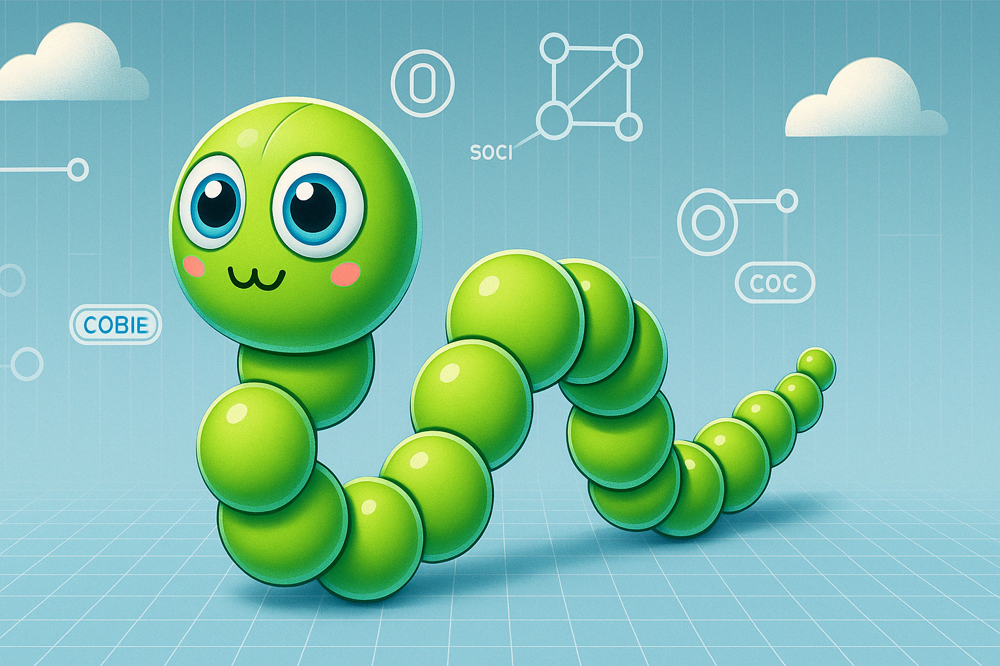

# Python bytes - Wiggle the snake

Make a colourful snake slither across the screen using variables and animation in Python.

Find the project online at [projects.raspberrypi.org/en/projects/python-bytes-wiggle-the-snake](https://projects.raspberrypi.org/en/projects/python-bytes-wiggle-the-snake)

## Resources
For project materials and solutions, see [en/resources](https://github.com/raspberrypilearning/python-bytes-wiggle-the-snake/tree/master/en/resources) and [en/solutions](https://github.com/raspberrypilearning/python-bytes-wiggle-the-snake/tree/master/en/solutions).

## Contributing
See [CONTRIBUTING.md](CONTRIBUTING.md)

## Licence
See [LICENCE.md](LICENCE.md)
