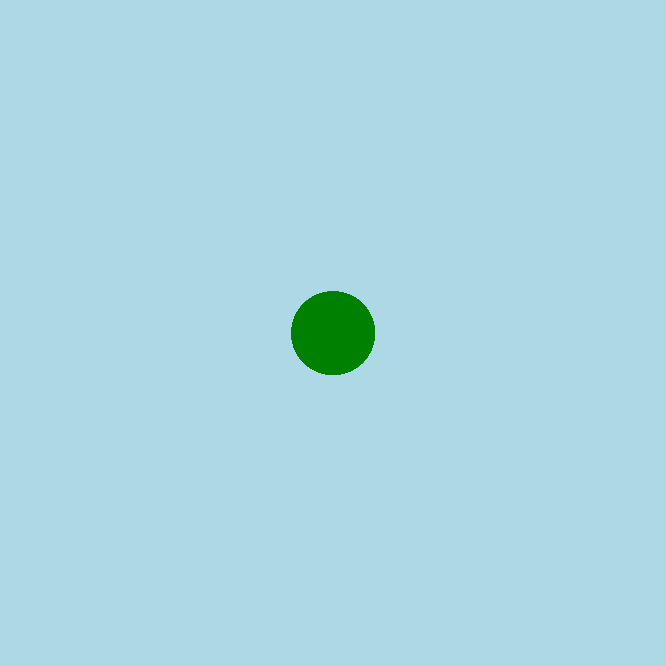

<h2 class="c-project-heading--task">Draw the snake's head</h2>
--- task ---
Draw a green circle in the middle of the screen to make your snake's head.
--- /task ---

<h2 class="c-project-heading--explainer">Hello, snake!</h2>

In this project, you’ll create a slithering animated snake using Python and p5.  
We’ll start by drawing a green circle for the snake’s head.

--- code ---
---
language: python
filename: main.py
line_numbers: true
line_number_start: 1
line_highlights: 9-10
---
from p5 import *
from math import sin

x = 0  # starting position of the snake

def setup():
    size(400, 400)
    background('lightblue')
    no_stroke()

def draw():
    fill('green')
    circle(200, 200, 50)

run()
--- /code ---

### Tip

Try changing the size of the circle or the colour. What happens if you move it left or right?

### Debugging

If you don’t see anything: 
- Make sure the `circle()` has **three numbers**: x, y, and size 
- Check that `setup()` and `draw()` are spelled correctly 
- Run your code again after saving

