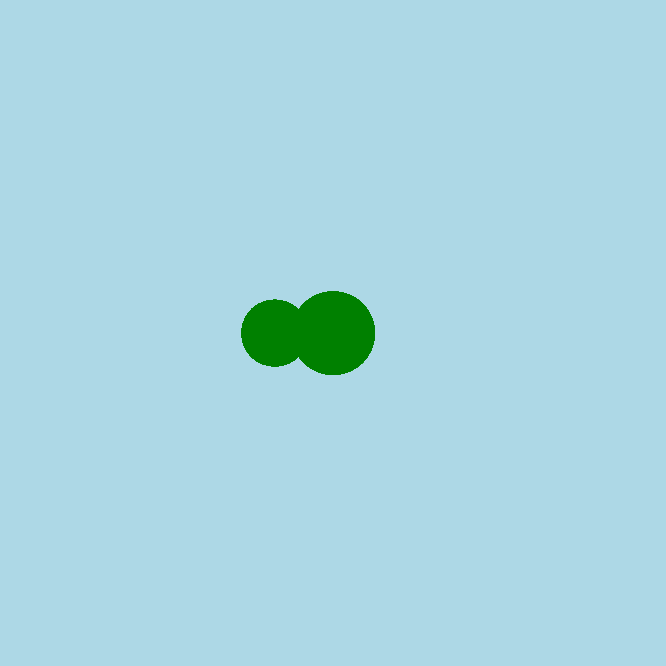

<h2 class="c-project-heading--task">Add a body segment</h2>
--- task ---
Draw a second green circle behind the snake’s head to make part of its body.
--- /task ---

<h2 class="c-project-heading--explainer">Stretching out</h2>

Let’s add a second circle behind the head. This will start to make the snake look longer.

You’ll need to:
- Use another `circle()`
- Make it slightly smaller than the head
- Move it a little to the left

--- code ---
---
language: python
filename: main.py
line_numbers: true
line_number_start: 13
line_highlights: 16
---
def draw():
    fill('green')
    circle(200, 200, 50)
    circle(165, 200, 40)

run()
--- /code ---

### Tip

Try changing the second circle’s position or size to see how it changes the snake’s body shape.

### Debugging

If the body doesn’t show up: 
- Did you use the `fill()` before the new `circle()`? 
- Are the numbers different so you can see two circles? 
- Make sure you saved your code and clicked run

