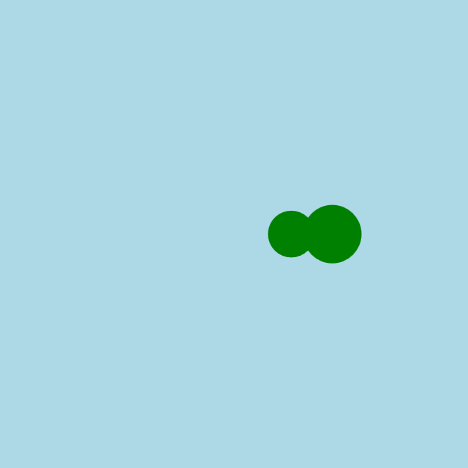

<h2 class="c-project-heading--task">Make the snake move</h2>
--- task ---
Use a variable to make your snake slither across the screen.
--- /task ---

<h2 class="c-project-heading--explainer">It’s alive!</h2>

You’re about to make your snake move across the screen.

We’ll use a variable called `x` to keep track of where the snake's head is.  
Each time `draw()` runs, we’ll add a little to `x` to move everything to the right.

The `draw()` function runs many times per second. That’s why we draw the background each time — it clears the screen so the snake doesn’t leave a trail.

--- code ---
---
language: python
filename: main.py
line_numbers: true
line_number_start: 13
line_highlights: 15, 17-18, 20
---
def draw():
    global x
    background('lightblue')
    fill('green')
    circle(x, 200, 50)  # head at x
    circle(x - 35, 200, 40)  # body at x - 35

    x += 2  # increase x by 2
--- /code ---

### Tip

Try changing how fast the snake moves by using a bigger or smaller number in `x += 2`.

### Debugging

If the snake doesn’t move: 
- Make sure `x = 0` comes **before** your functions 
- Did you use `global x` inside `draw()`? 
- Are you updating `x` with `x += 2`?

