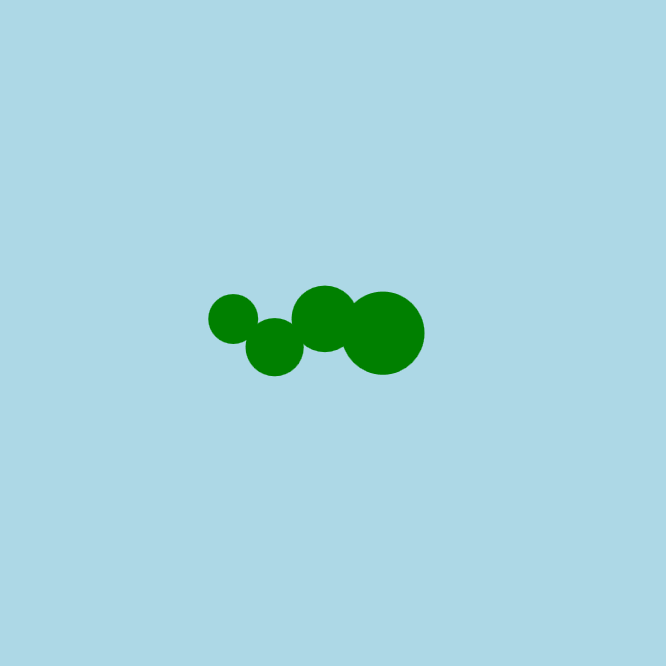

<h2 class="c-project-heading--task">Add a wiggle</h2>
--- task ---
Use a wobbly offset to make your snake slither side to side.
--- /task ---

<h2 class="c-project-heading--explainer">Make it wriggle!</h2>

Let’s make your snake **slither** by adding a smooth up-and-down wiggle to its body.

We’ll create a new variable called `offset`. This will change a little bit each time your code runs — kind of like a wave that goes up and down slowly.

You’ll use it to move the body segments up and down in a smooth way.  
We’ll use something called `sin()`, which is part of Python’s math tools.

Don’t worry about how it works — it just gives us a nice smooth curve that we can use for animation.

--- code ---
---
language: python
filename: main.py
line_numbers: true
line_number_start: 13
line_highlights: 14-17
---
def draw():
    global x
    background('lightblue')
    fill('green')

    offset = sin(x * 0.1) * 10

    circle(x, 200, 50)               # head at x
    circle(x - 35, 200 + offset, 40) # body 1
    circle(x - 65, 200 - offset, 35) # body 2
    circle(x - 90, 200 + offset, 30) # tail

    x += 2  # increase x by 2
--- /code ---

### Tip

Try changing the numbers in `offset = sin(x * 0.1) * 10`:
- The `0.1` controls the **speed** of the wiggle
- The `10` controls how **big** the wiggle is

### Debugging

If the wiggle doesn’t work: 
- Did you use `offset` to change the **y** positions of the circles? 
- Are your brackets and spelling correct? 
- Try checking if your `circle()` lines match the example

