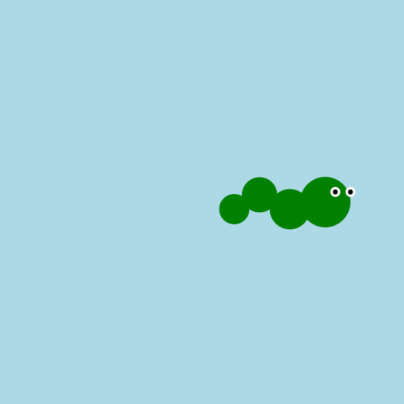

<h2 class="c-project-heading--task">Give your snake some style</h2>
--- task ---
Add eyes, colours, or decorations to personalise your snake.
--- /task ---

<h2 class="c-project-heading--explainer">Make it yours</h2>

Your snake is slithering along — now it’s time to give it some personality!

You can:
- Add white eyes with black pupils
- Change the colour of the body or each segment
- Add stripes, a tongue, or even a party hat!

Here’s one example:

--- code ---
---
language: python
filename: main.py
line_numbers: true
line_number_start: 21
line_highlights: 24-26
---
    circle(x, 200, 50)               # head at x
    circle(x - 35, 200 + offset, 40) # body 1
    circle(x - 65, 200 - offset, 35) # body 2
    circle(x - 90, 200 + offset, 30) # tail

    fill('white')
    circle(x + 10, 190, 10)
    circle(x + 25, 190, 10)

    fill('black')
    circle(x + 10, 190, 5)
    circle(x + 25, 190, 5)
--- /code ---

### Tip

Want to get creative?
- Try adding red `circle()`s for cheeks
- Use `fill('blue')` or any other colour you like
- Make the snake blink or wear a crown!

### Debugging

If something disappears: 
- Did you **set `fill()`** before each circle? 
- Are the x and y numbers near the snake’s head? 
- Remember: circles near the bottom of your code appear **on top**

