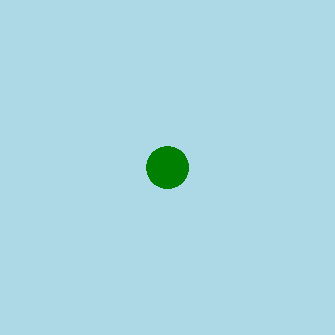

<h2 class="c-project-heading--task">Намалюй голову змії</h2>

\--- task ---

Посередині екрану намалюй зелений круг, який буде головою змії.

\--- /task ---

<h2 class="c-project-heading--explainer">Привіт, змійко!</h2>

У цьому проєкті ти створиш анімовану змію, що ковзає, за допомогою Python та p5.  
Спочатку намалюй зелений круг для голови змії.

--- code ---
---
language: python
filename: main.py
line_numbers: true
line_number_start: 1
line_highlights: 14, 15
---

from p5 import \*
from math import sin

x = 0 # початкова позиція змії

def setup():
size(400, 400)
background('lightblue')
no_stroke()

def draw():
fill('green')
circle(200, 200, 50)

run()

\--- /code ---

### Порада

Спробуй змінити розмір або колір круга.

### Налагодження

Якщо нічого не відбувається:  

- Переконайся, що `circle()` має **три числа**: x, y та розмір 
- Збережи й знову запусти свій код

