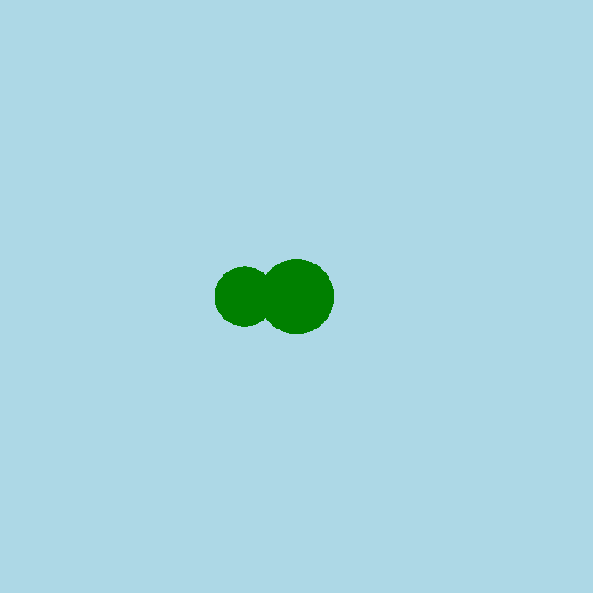

<h2 class="c-project-heading--task">Додай частину тулуба</h2>

--- task ---

Намалюй ще один зелений круг позаду голови змії, — це буде частина її тулуба.

--- /task ---

<h2 class="c-project-heading--explainer">Розтягуємо</h2>

Додай позаду голови ще один круг. Так твоя змія здаватиметься довшою.

Тобі потрібно буде:
- Знову використати `circle()` і намалювати круг
- Зробити цей круг трохи меншим за голову
- Посунути його трохи ліворуч

--- code ---
---
language: python
filename: main.py
line_numbers: true
line_number_start: 13
line_highlights: 16
---

def draw():
fill('green')
circle(200, 200, 50)
circle(165, 200, 40)

run()

--- /code ---

### Порада

Спробуй змінити положення або розмір другого круга. Як змінилася форма тіла змії?

### Налагодження

Якщо тіло не видно: 
- Чи відрізняються розміри двох кругів? 
- Запусти код ще раз

