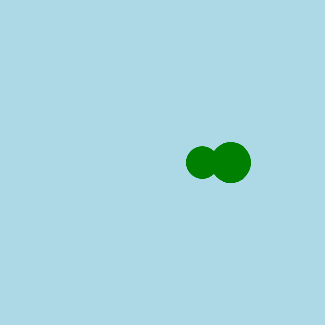

<h2 class="c-project-heading--task">Змія рухається</h2>

--- task ---

Використай змінну, щоб змія заковзала по екрану.

--- /task ---

<h2 class="c-project-heading--explainer">Вона ожила!</h2>

Ще трохи, і змійка почне рухатися екраном.

Використай змінну під назвою `x` (англійською), щоб відстежувати місце розташування голови змії.  
Щоразу, коли виконується `draw()`, ми трохи збільшуватимемо `x`, щоб усе зміщувалося праворуч.

Функція `draw()` виконується багато разів на секунду. Ось чому ми кожного разу малюємо тло, — воно очищає екран, і змія не залишає за собою слід.

--- code ---
---
language: python
filename: main.py
line_numbers: true
line_number_start: 13
line_highlights: 14-15, 17-18, 20
---

def draw():
global x
background('lightblue')
fill('green')
circle(x, 200, 50)  # голова на x
circle(x - 35, 200, 40)  # тулуб x - 35

    x += 2 # щоби збільшити х вдвічі

--- /code ---

### Порада

Спробуй змінити швидкість руху змії, використовуючи більше або менше число в `x += 2`.

### Налагодження

Якщо змія не рухається: 
- Ти використовуєш `global x` всередині функції `draw()`? 
- Ти збільшуєш `x` за допомогою виразу `x += 2`?

