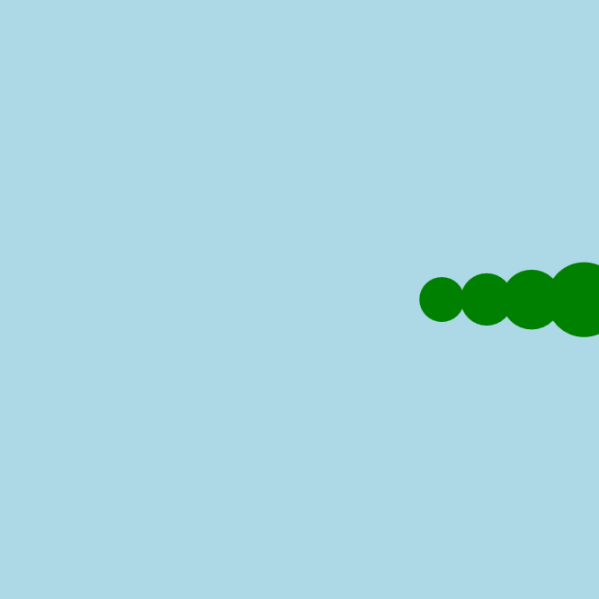

<h2 class="c-project-heading--task">Зроби змію довшою</h2>

\--- task ---

Додай іще два круги позаду змії, які завершать її тулуб.

\--- /task ---

<h2 class="c-project-heading--explainer">Ковзь, ковзь...</h2>

Зроби тулуб змії довшим, додавши ще два сегменти позаду.

Продовжуй використовувати змінну `x` та віднімай різні числа, щоб розмістити кожний круг в потрібному місці.

Кожен з них має бути трохи меншим і розташованим лівіше за попередній.

--- code ---
---
language: python
filename: main.py
line_numbers: true
line_number_start: 13
line_highlights: 19-20
---

def draw():
global x
background('lightblue')
fill('green')
circle(x, 200, 50)        # голова в точці x
circle(x - 35, 200, 40)   # круг 1
circle(x - 65, 200, 35)   # круг 2
circle(x - 90, 200, 30)   # хвіст

    x += 2 # щоби збільшити х вдвічі

run()

\--- /code ---

### Порада

- Спробуй використати різні розміри кругів, щоб змійка була вгодована або струнка. 
- Ти також можеш змінити відстань між кругами.

### Налагодження

Якщо деяких частин тіла не видно: 

- Перевір, чи кожна функція `circle()` має 3 числа 
- Пошукай помилки у словах або пропущені коми 
- Пам'ятай: кожен наступний відрізок знаходиться все лівіше й лівіше (використовуй `x - ...`)

