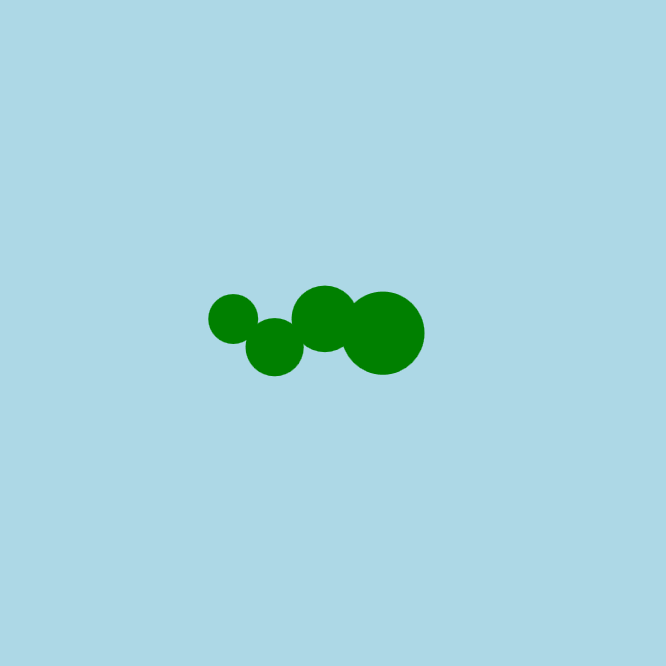

<h2 class="c-project-heading--task">Додай руху</h2>

\--- task ---

Щоб змісити змію рухатись зі сторони в сторону, використовуй хвилеподібний рух.

\--- /task ---

<h2 class="c-project-heading--explainer">Нехай вона звивається!</h2>

Щоб наша змія почала **звиватися**, додамо її тілу плавний хвилеподібний рух.

Створи нову змінну з назвою `offset`. Вона трохи змінюватиметься щоразу, як запускається код, — щось на кшталт хвилі, яка повільно підіймається та опускається.

Ти використаєш його, щоб частини тіла плавно рухалися вгору і вниз.  
Ти використаєш функцію під назвою `sin()`, яка є частиною математичних інструментів Python.

Тобі не обовʼязково знати, як вона працює. Вона просто дасть нам гарну плавну криву для анімації.

--- code ---
---
language: python
filename: main.py
line_numbers: true
line_number_start: 13
line_highlights: 18, 21-23
---

def draw():
global x
background('lightblue')
fill('green')

    offset = sin(x * 0.1) * 10
    
    circle(x, 200, 50)               # голова в точці x
    circle(x - 35, 200 + offset, 40) # тулуб 1
    circle(x - 65, 200 - offset, 35) # тулуб 2
    circle(x - 90, 200 + offset, 30) # хвіст
    
    x += 2  # щоби збільшити х вдвічі

\--- /code ---

### Порада

Спробуй змінити числа в `offset = sin(x * 0.1) * 10`:

- `0.1` контролює **швидкість** ковзання
- `10` контролює **діапазон** коливання

### Налагодження

Якщо ковзання не працює: 

- Чи ти використовуєш `offset`, щоб змінити координати **y** кругів? 
- Чи правильні твої дужки та написання? 
- Перевір, чи відповідають твої рядки з функцією `circle()` прикладу

