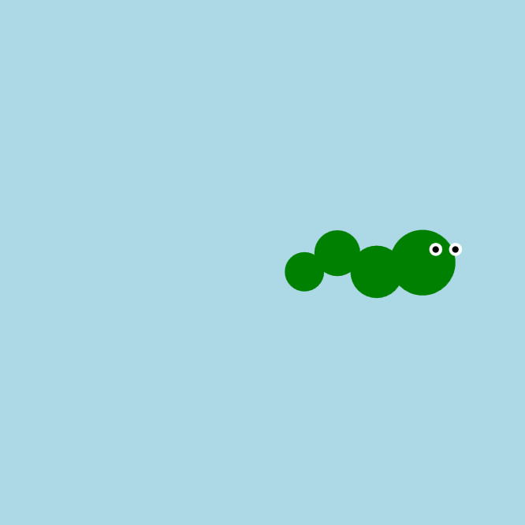

<h2 class="c-project-heading--task">Додай стилю своїй змії</h2>

--- task ---

Додай очі, кольори або прикраси, щоб персоналізувати свою змію.

--- /task ---

<h2 class="c-project-heading--explainer">Персоналізація</h2>

Твоя змія повзе — час надати їй вайбу!

Ти можеш:

- Додати білі очі з чорними зіницями
- Змінити колір тіла або кожного круга
- Додати смужки, язик або навіть святковий капелюшок!

Ось приклад:

--- code ---
---
language: python
filename: main.py
line_numbers: true
line_number_start: 20
line_highlights: 25-27, 29-31
---

    circle(x, 200, 50)               # голова в точці x
    circle(x - 35, 200 + offset, 40) # тулуб 1
    circle(x - 65, 200 - offset, 35) # тулуб 2
    circle(x - 90, 200 + offset, 30) # хвіст
    
    fill('white')
    circle(x + 10, 190, 10)
    circle(x + 25, 190, 10)
    
    fill('black')
    circle(x + 10, 190, 5)
    circle(x + 25, 190, 5)

--- /code ---

### Порада

Додамо креативу?

- Спробуй додати червоні круги для щічок за допомогою функції `circle()`
- Заповни змію улюбленим кольором (наприклад, `fill('blue')`)
- Одягни на змію корону чи зроби, щоб вона кліпала очима!

### Налагодження

Якщо щось зникає: 

- Чи в коді додано `fill()`\*\* перед кожним новим кругом? 
- Чи знаходяться числа x та y біля голови змії? 
- Пам’ятай: круги, додані внизу твого коду, з'являються **зверху** на зображенні

### Зворотний зв’язок

Це бета-проєкт, тобто він абсолютно новий і доступний не скрізь. Якщо ви тестували цей проєкт самостійно або зі своїм клубом, поділіться своєю думкою.

<a href="https://form.raspberrypi.org/4874054?tfa_6933=python-wild-wiggle-the-snake" style="
    display: inline-block;
    padding: 10px 20px;
    border: 2px solid black;
    border-radius: 999px;
    font-weight: bold;
    font-size: 16px;
    background-color: white;
    color: black;
    text-align: center;
    text-decoration: none;
    transition: background-color 0.2s;
" onmouseover="this.style.backgroundColor='#f0f0f0';" onmouseout="this.style.backgroundColor='white';">
Залишити відгук </a>

***
Цей проєкт переклали волонтери:

Solomiia Kosmus

Завдяки волонтерам ми надаємо можливість людям у всьому світі навчатися рідною мовою. Ви також можете допомогти нам у цьому — більше інформації про волонтерську програму на [rpf.io/translate](https://rpf.io/translate).
